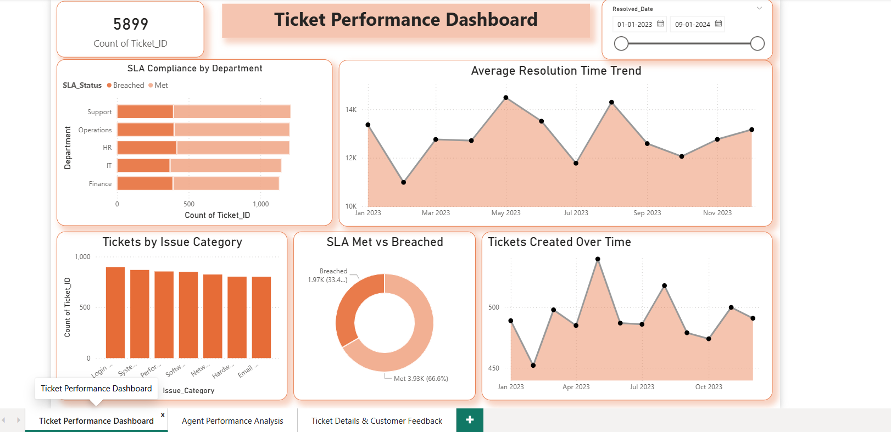
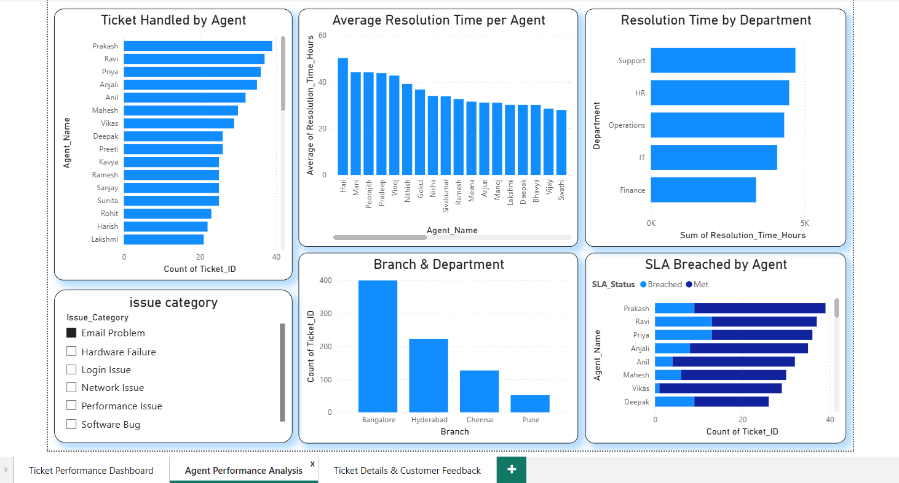
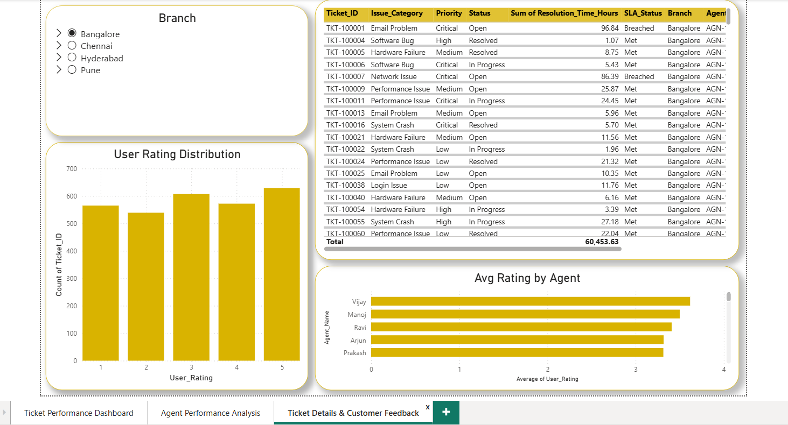

# Helpdesk Analyzer Dashboard

## Project Overview
This project is a Helpdesk Ticket Analysis Dashboard created using Python and Power BI.

The dashboard helps analyze:
- Ticket status
- User ratings
- Agent performance
- Resolution time
- SLA status
- Branch-wise support analysis

---

## Tools & Technologies Used
- Python
- Pandas
- NumPy
- Power BI

---

## Features
- Interactive dashboard
- Ticket performance tracking
- User rating analysis
- Agent performance analysis
- SLA monitoring
- Branch-wise filtering

---

## Dashboard Preview

---

## Project Files
- `Helpdesk_Visual.pbix` → Power BI dashboard
- `helpdesk_analyzer.ipynb` → Python analysis notebook
- `dataset.csv` → Dataset used for analysis

---

## Learning Outcomes
Through this project, I learned:
- Data analysis using Python
- Dashboard creation using Power BI
- Data visualization
- Report generation
- Business insights analysis

---

## Author
VinojKumar

GitHub:
https://github.com/vinojkumar20
